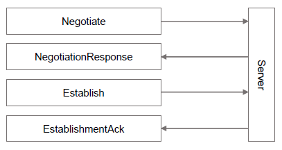

# Sessions

The WebSocket API employs the Point-to-Point Session Protocol defined by the FIX Performance Session Layer (FIXP). 

For further information, please refer to the [FIXP specification](https://github.com/FIXTradingCommunity/fixp-specification) 
from the FIX Trading Community.

To create logical session after successful connection to the WS API, the client must send a Negotiate message.
After successful negotiation, an Establish message must be sent to reach an established state before application messages can be sent.

The lifetime of an established state is relative to the current WS connection.

[](websocketSessionsDiagram.png)

## Negotiate message
The Negotiate message is used to create a logical session and should conform to the following format.

| Key         | Type   | Required | Description                         | Value         |
|-------------|--------|----------|-------------------------------------|---------------|
| MessageType | String | Y        | Fixed constant value                | "Negotiate"   |
| SessionId   | String | Y        | Version 4 random UUID               |               |
| Timestamp   | Number | Y        | Timestamp in Unix epoch nanoseconds |               |
| ClientFlow  | String | Y        | Type of client-server flow          | "Unsequenced" |
| Credentials | Object | Y        | Refer to CredentialsObject          |               |

### CredentialsObject
| Key             | Type   | Required | Description                              | Value   |
|-----------------|--------|----------|------------------------------------------|---------|
| CredentialsType | String | Y        | Fixed constant value                     | "login" |
| Token           | String | Y        | Token string in format USERNAME:PASSWORD |         |

### Example Request
```json
{
    "MessageType": "Negotiate",
    "Timestamp": 1573727261820000000,
    "SessionId": "621224d9-995a-4a05-bd4e-d40589db71d0",
    "ClientFlow": "Unsequenced",
    "Credentials": {
        "CredentialsType": "login",
        "Token":"yourusername:yourpassword"
    }
}
```

## NegotiationResponse message
Upon successful negotiation, the server will respond with a NegotiationResponse message.

| Field name       | Type   | Required | Description                                      | Value                 |
|------------------|--------|----------|--------------------------------------------------|-----------------------|
| MessageType      | String | Y        | Fixed constant value                             | "NegotiationResponse" |
| SessionId        | String | Y        | Same SessionId from the Negotiate message        |                       |
| RequestTimestamp | Number | Y        | Same RequestTimestamp from the Negotiate message |                       |
| ServerFlow       | String | Y        | Type of flow from client to server               | "Unsequenced"         |


### Example Response
```json
{
    "SessionId": "621224d9-995a-4a05-bd4e-d40589db71d0",
    "RequestTimestamp": 1573727261820000000,
    "ServerFlow": "Unsequenced",
    "MessageType": "NegotiationResponse"
}

```

## NegotiationReject
If the negotiation was unsuccessful, the server will respond with a NegotiationReject message.

| Field name       | Type   | Required | Description                                      | Value                                                             |
|------------------|--------|----------|--------------------------------------------------|-------------------------------------------------------------------|
| MessageType      | String | Y        | Fixed constant value                             | "NegotiationReject"                                               |
| SessionId        | String | Y        | Same SessionId from the Negotiate message        |                                                                   |
| RequestTimestamp | Number | Y        | Same RequestTimestamp from the Negotiate message |                                                                   |
| Code             | String | Y        | NegotiationRejectCode value                      | Credentials \| Unspecified \| FlowTypeNotSupported \| DuplicateId |
| Reason           | String | N        | Reason for rejection message                     |                                                                   |

## Establish message
After receiving a NegotiationResponse, send an Establish message conforming to the following format.

| Key               | Type   | Required | Description                                                | Value       |
|-------------------|--------|----------|------------------------------------------------------------|-------------|
| MessageType       | String | Y        | Fixed constant value                                       | "Establish" |
| SessionId         | String | Y        | Same SessionId from the Negotiate message                  |             |
| Timestamp         | Number | Y        | Timestamp in Unix epoch nanoseconds                        |             |
| KeepaliveInterval | Number | Y        | Interval in milliseconds between client keepalive messages |             |

### Example Request
```json
{
    "MessageType": "Establish",
    "Timestamp": 1573727261820000010,
    "SessionId": "621224d9-995a-4a05-bd4e-d40589db71d0",
    "KeepaliveInterval": 3000000
}
```

## EstablishmentAck
Upon successfully reaching an established state, the server will respond with an EstablishmentAck message.

| Field name        | Type   | Required | Description                                                | Value              |
|-------------------|--------|----------|------------------------------------------------------------|--------------------|
| MessageType       | String | Y        | Fixed constant value                                       | "EstablishmentAck" |
| SessionId         | String | Y        | Same SessionId from the Negotiate/Establish message        |                    |
| RequestTimestamp  | Number | Y        | Same RequestTimestamp from the Establish message           |                    |
| KeepaliveInterval | Number | Y        | Interval in milliseconds between server keepalive messages |                    |

### Example Response
```json
{
    "SessionId": "621224d9-995a-4a05-bd4e-d40589db71d0",
    "RequestTimestamp": 1573727261820000010,
    "KeepaliveInterval": 30001,
    "MessageType": "EstablishmentAck"
}

```

## EstablishmentReject
If an established state could not be reached, the server will respond with an EstablishmentReject message.

| Field name       | Type   | Required | Description                                         | Value                                                                                                   |
|------------------|--------|----------|-----------------------------------------------------|---------------------------------------------------------------------------------------------------------|
| MessageType      | String | Y        | Fixed constant value                                | "EstablishmentReject"                                                                                   |
| SessionId        | String | Y        | Same SessionId from the Negotiate/Establish message |                                                                                                         |
| RequestTimestamp | Number | Y        | Same RequestTimestamp from the Establish message    |                                                                                                         |
| Code             | String | Y        | EstablishmentRejectCode value                       |                                                                                                         |
| Reason           | String | N        | Reason for rejection message                        | Unnegotiated \| AlreadyEstablished \| SessionBlocked \| KeepaliveInterval \| Credentials \| Unspecified |

## Heartbeats

### Client Heartbeat
The KeepaliveInterval property of the Establish message sets the duration of heartbeat intervals for the client.
Within each interval, a heartbeat message must be sent to keep the connection alive if no other messages were sent, before
the entire KeepaliveInterval has elapsed.


| Key         | Type   | Required | Description          | Value                  |
|-------------|--------|----------|----------------------|------------------------|
| MessageType | String | Y        | Fixed constant value | "UnsequencedHeartbeat" |

#### Example Request
```json
{
    "MessageType": "UnsequencedHeartbeat"
}
```

### Server Heartbeat
The server will also send heartbeats of its own, at the interval specified in the EstablishAck message.

In case no heartbeat is received from the server, the connection should be terminated and then re-established.

## Termination

The session can be terminated simply by sending a WebSockets close signal and disconnecting.
As an unsequenced client and server flow is used, the lifetime of the session is also bound to that of the WS connection.

Refer to the [Point-to-point session protocol](https://github.com/FIXTradingCommunity/fixp-specification/blob/master/v1-1/doc/04PointToPointSessionProtocol.md) 
page in the FIXP documentation for more information.