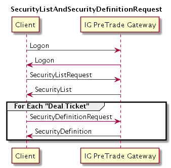

# API Notes for Knock-out CFDs

## Introduction

This document provides notes for the representation of Knock-out CFDs in the API.

See the "General introduction to [Knock Outs](./knockOuts.md)" for product information.

See IG's FIX OTC API Rules of Engagement document for details of the supported and required Message and Fields.

IG provides pricing on the Underlying Instrument for the Knock-out. The price used for trading at a specific Barrier Price (Knock-out Level) must be derived using the Barrier Price and Underlying Price as described in the [PreTrade](#PreTrade) section of this document.

The applicable Barrier and Strike Prices are defined in the ComplexEvents group in the Instrument component of Security Definition messages. This is described in [PreTrade](#PreTrade). For Knock-out CFDs the Strike Price and the Barrier Price are identical.

In trading messages the Strike field and PutOrCall field must be provided along with the ComplexEvents Group. This is described in [Trade](#Trade).

## PreTrade

The permitted Knock-out Barrier Prices (Knock-out Levels) are specified in the ComplexEvents group in the Instrument component of Security Definition messages. ComplexEvents are not present in the Security List messages. A Security Definition Request must be made to determine the applicable Barrier and Strikes prices.

The Account must be specified to determine the permitted range of prices. This range may also change over time. For example the permitted Minimum and Maximum Strike and Barrier price may change when the Underlying exchange is closed. Accordingly it is advised to request the Security Definition before presenting the range of prices.

Provide Account on a Security Definition Request message to obtain the ComplexEvents group.

### SecurityGroup
The following Security Groups are for Knock-outs.

* "KNOCKOUTS_INDICES”
* “KNOCKOUTS_COMMODITIES”
* “KNOCKOUTS_CURRENCIES”
* “KNOCKOUTS_SHARES”

### PutOrCall
The PutOrCall field in the Instrument component can help identity Bull vs Bear Knock-outs.

* Bull : PutOrCall = "Call"
* Bear : PutOrCall = "Put"

### MaturityMonthYear
Knock-out CFDs have an expiry. The MaturityMonthYear field will be provided in the Instrument component of Security Definition messages and SecListGrp in Security List Messages.

### Complex Events Group

Complex Events define the permitted sets of Barrier prices (Knock-out Levels) and Strike prices. This is a repeating group and will specify the range of permissible prices.

#### ComplexEventType

The ComplexEventType will be "KnockOutDown(6)".

#### ComplexEventPrice

The ComplexEventPrice is the Barrier Price (Knock-out Level)

#### 	ComplexEventStrikePrice

The ComplexEventStrikePrice is the Strike Price. This will be identical to the ComplexEventPrice but is included to complete the specification of the option.

### Pricing Knock-out CFDs

The Knock-out Premium is available from the Security List message. It can be found in the Instrument Attribute Group.

The price to present for a given Barrier Price (Knock-out level) is:

* Bull
  * Bid   : (IG Underlying Bid price - Barrier Price) + Knock-out premium
  * Offer : (IG Underlying Offer price - Barrier Price) + Knock-out premium
* Bear
  * Bid (Barrier Price - IG Underlying bid price) + Knock-out premium
  * Offer : (Barrier Price - IG Underlying Offer price) + Knock-out premium

## Trade

### MaturityMonthYear

The MaturityMonthYear must be specified in the Instrument component of orders for Knock-out CFDs.

### ComplexEvents

The Complex Event group in the Instrument component must be included on Orders to specify the requested Barrier price (in field ComplexEventPrice) and Strike price (in field ComplexEventStrikePrice). The Barrier and Strike price must both be present and be equal. The ComplexEventType must be "KnockOutDown(6)". Only one entry is permitted per Order.

### Order Types

The following Order Types are supported for Knock-outs:

* Market
* Previously Quoted

### Time In Force

The following Time In Force are supported for Knock-outs:

* IOC (Immediate Or Cancel)
* FOK (Fill Or Kill)

### Order Messages

The following order messages are applicable for Knock-outs:
* NewOrderSingle
  * Can be used to open a Position or to "attach" a Stop and/or Limit order to a Knock-out Position. The attached orders may not be Knock-outs.
* NewOrderList
  * Can be used the place an Order with contingent Stop and/or Limit orders. The contingent orders may not be Knock-outs. Only FOK and IOC orders are applicable for Knock-outs, working orders for Knock-outs will not exist. Therefore "List Cancel Request" messages are not expected:

The following messages are applicable for working orders attached to an open Knock-out Position and also for contingent orders which have not yet been triggered.

* Order Cancel/Replace Request
* Order Cancel Request

## Post Trade

Open Knock-out Positions can be closed using a Position Maintenance Request. Closing the Position will cancel any attached Stop and/or Limit Orders.
