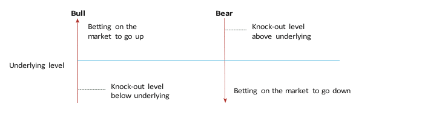

# Introduction to Knock-outs
## What is a Knock-out ?
A knock-out is a limited-risk CFD position which automatically closes, is ‘knocked out’, if the underlying cash price reaches the client’s knock-out level.

Knock-out prices move one-for-one with the underlying IG price. By choosing the knock-out level and the trade size, the maximum risk for each trade is controlled. The maximum risk is the price multiplied by the  order quantity.

Knock-outs can only be bought to open a position (not sold to open). To enable clients to go long or short there are two types of knock-out available: Bull and Bear:

Clients would buy a Bull knock-out if they believe the price of the underlying market will rise. The knock-out levels available will be below the current market price.

Clients would buy a Bear knock-out if they believe the price of the underlying market will fall. The knock-out levels available will be above the current market price.



Once the client has decided whether to open a Bull or a Bear, they need to choose a knock-out level – the level at which the position will be closed if the market moves against them. The knock-out level can be compared to a guaranteed stop, with the important difference that it cannot be changed once set. Clients can close their position at any time, unless the knock-out level is reached – in which case it will automatically close.

## How are Knock-outs priced?

The opening price will  be:

* Bull - (underlying IG offer price - knock-out level) + knock-out premium (see note)
* Bear - (knock-out level - underlying IG bid price) + knock-out premium (see note)

note : The knock-out premium is the guarantee against slippage. It is only payable if the knock-out level is triggered.

## An example trade

Let’s say the Hong Kong HS50 is currently trading with an offer price of 26050.1. To go long, open a bull position at HK$5 per point with a knock-out level at 25850.1. If the current knock-out premium is 10, the margin required is as follows:


The knock-out price will move one-for-one with the underlying IG market – so for every point our underlying price moves, the knock-out price moves exactly the same amount (N.B. If the knock-out premium changes, the price of the knock-out will also move by the amount that the premium changes).
* If the HS50 rises and the current bid becomes 26150.1, the running profit would be +500.
* If the HS50 drops and the current bid becomes 25950.1, the running loss would be -500.
* If the HS50 drops to your knock-out level, the realised loss would be -1050, which includes the 10 point knock-out premium.

With knock-outs, the price moves one-for-one with IG’s underlying market price. This is not affected by time to expiry or how close the underlying is to the knock-out level. Due to the fact that the position gets ‘knocked out’ when the knock-out level is reached, without the opportunity for it to bounce back some time in the future, the knock-out level acts more like a guaranteed stop than a vanilla option’s knock-out price.

## Comparison to vanilla options

If you are used to vanilla options, you’ll know that the more an option moves from ‘deep in the money’ to ‘at the money’, the smaller the delta of the option becomes – this is not the case with knock-outs. Similarly a one-point move in the underlying does not necessarily equate to a one-point move in a vanilla option premium, whereas a knock-out price moves one-for-one with IG’s underlying market.1

### Fees

* Spread: the difference between the bid and ask.
* Overnight funding charge: calculated based on the notional value of the underlying market and not the knock-out price. So in the previous example, the notional amount would be the current underlying level of 7400, multiplied by the size.
* Knock-out premium: protects the client from slippage on the knock-out level, similar to a guaranteed stop. Because the knock-out premium is included in the spread, clients selling to close receive the premium back – therefore they only pay the premium if their knock-out level is hit.

### Leverage
The client’s leverage is determined by the knock-out level chosen and the resulting knock-out price:

Leverage = Notional / Price

Given an example of a FTSE100 BULL KO at 7000, when IG’s underlying price is 7400 the leverage amount would be 18.5 per unit quantity:

```
7400 / (7400 - 7000) = 18.5
```

### A note on dividends

Constituent stocks of an index will periodically pay dividends to shareholders. When they do, this impacts the overall value of the index – causing it to drop by a certain amount.

This is naturally detrimental to bull knock-out holders and beneficial to bear knock-out holders. To counteract this effect, we will credit clients who are long bull knock-outs and debit client who are long bear knock-outs. This ensures there is no material impact on our clients.
